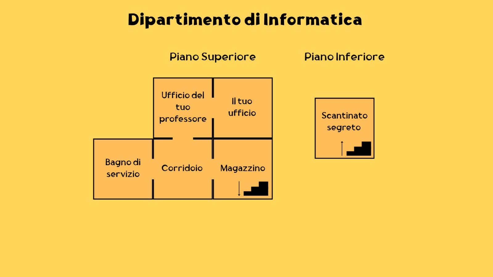
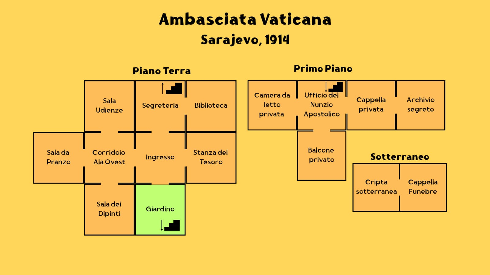

# Soluzione del Gioco: "Kronox 1914"

**Passaggi per avviare il gioco:**

1.  **Avviare il Server:**
    * Apri un terminale o prompt dei comandi (per esempio Powershell).
    * Naviga nella directory `target/` del progetto (dove si trovano i file JAR generati).
    * Esegui il comando:
        ```java -jar KRONOX1914-server-standalone.jar```
    per eseguire il progetto con main class server.java.
    * Dovresti vedere un messaggio che indica che il "SERVER DI GIOCO AVVIATO - In attesa sulla porta 12345".
    * **Importante:** Mantieni questo terminale aperto. Per chiudere il server pulitamente in seguito, premi `Ctrl+C` in questa stessa finestra.

2.  **Avviare il Client:**
    * Apri un **nuovo** terminale o prompt dei comandi.
    * Naviga nella directory `target/` del tuo progetto.
    * Esegui il comando:
        ```java -jar KRONOX1914-client-standalone.jar```
    * Si aprirà la finestra grafica del gioco. Il client tenterà automaticamente di connettersi al server.
    * **Alternativa Windows:** È anche possibile fare click con il tasto destro sul file `KRONOX1914-client-standalone.jar` ed aprirlo con JAVA(TM) Platform SE Binary.

3. **Adesso puoi giocare!**

Ovviamente è anche possibile avviare entrambi i processi utilizzando l'IDE NetBeans.

Una volta connesso, ti verrà presentata la schermata di benvenuto con la scelta dello slot di salvataggio. Segui le istruzioni a schermo per iniziare o caricare una partita.

Per maggiori dettagli visitare il manuale utente (manuale_utente.md).

## Mappe del gioco
Seguono le mappe del gioco dei due ambienti principali che mostrano tutte le stanza, anche quelle segrete che verranno scoperte nel gioco stesso.
**Dipartimento di Informatica - Presente**
<p align="center">
  
</p>

**Ambasciata Vaticana (Sarajevo) - 1914**   
<p align="center">
  
</p>

## Sequenza di mosse che fanno terminare il gioco
**Dipartimento di Informatica - Presente**
1. Leggi lettera  
2. Ovest  
3. Apri cassetto  
4. Leggi indovinello  
5. Prendi indovinello  
6. Prendi chiave  
7. Sud  
8. Usa chiave per aprire porta ad est  
9. Est  
10. Apri scatola  
11. Prendi pendrive  
12. Sposta scala  
13. Apri botola  
14. Scendi le scale  
15. Accendi la luce  
16. Usa pendrive sul terminale  
17. Usa 28.06.1914 sul terminale

**Ambasciata Vaticana (Sarajevo) - 1914**

1. Nord  
2. Parla con il segretario  
3. Sali le scale  
4. Parla con il Nunzio Apostolico  
5. Scendi le scale  
6. Sud  
7. Est  
8. Apri sportello orologio  
9. Prendi criptex  
10. Ovest  
11. Ovest  
12. Sud  
13. Sposta quadro  
14. Nord  
15. Nord  
16. Osserva leggio  
17. Sud  
18. Ovest  
19. Vedi a capotavola  
20. Inserisci pax sul criptex  
21. Prendi chiave  
22. Est  
23. Est  
24. Nord  
25. Sali le scale  
26. Ovest  
27. Apri armadio  
28. Apri tasche del cappotto  
29. Prendi pergamena  
30. Est  
31. Est  
32. Sposta confessionale  
33. Usa 9537 sulla porta  
34. Est  
35. Leggi telegramma  
36. Prendi telegramma  
37. Leggi documento  
38. Prendi documento  
39. Ovest  
40. Ovest  
41. Scendi scale  
42. Sud  
43. Sud  
44. Usa chiave sulla statua  
45. Scendi nella cripta  
46. Ovest  
47. Prendi anello  
48. Est  
49. Usa anello sul libro
